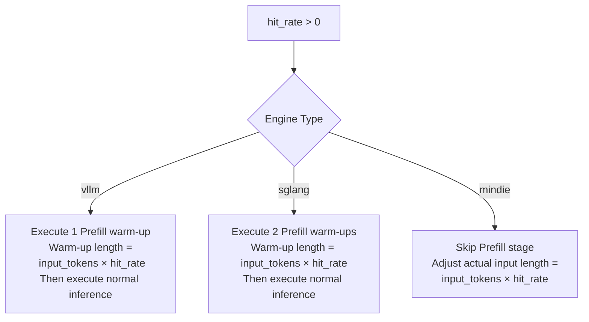

 # 🚀 LLM Performance Benchmark Suite | LLM Performance Benchmark

> 🎯 **Core Capabilities**: Under diverse load conditions, accurately measure inference service **latency distribution** (TTFT/TBT), **throughput ceiling**, **concurrency stability**, and **Prefix Caching hit rate effectiveness**.

---

## 📋 Table of Contents

- [🔧 Functional Overview](#-functional-overview)
- [⚙️ Configuration System](#️-configuration-system)
- [🎮 Test Execution](#-test-execution)
- [📊 Results Interpretation](#-results-interpretation)
- [✅ Quality Gates](#-quality-gates)

---

## 🔧 Functional Overview

This test framework is specifically designed for **LLM inference services**, supporting automated evaluation of the following key dimensions:

| Test Dimension | Evaluation Focus | Applicable Scenarios |
|---------|---------|---------|
| ⏱️ **Latency Analysis** | TTFT (Time To First Token), TBT (Time Between Tokens), End-to-End Latency | Real-time interactive applications (Chatbots) |
| 🚀 **Throughput Capacity** | Total / Incremental Throughput | High-concurrency batch processing |
| 🔄 **Concurrency Stability** | Performance degradation curves under different concurrency levels | Capacity planning and rate limiting strategies |
| 💾 **Cache Efficiency** | Prefix Cache Hit Rate (Prefill reuse rate) | Long-context repeated query optimization |

---

## ⚙️ Configuration System

### 1️⃣ Basic Environment Configuration (`config.yaml`)

Defines **model, service endpoint, and environment parameters**:

| Parameter | Type | Required | Description | Example Value |
|------|------|------|------|--------|
| `model` | string | ✅ | Model identifier name | `Qwen3-32B` |
| `server_url` | string | ✅ | Inference service HTTP endpoint | `http://141.111.32.70:8244 ` |
| `tokenizer_path` | string | ✅ | Tokenizer local path | `/mnt/model/Qwen3-32B` |
| `llm_type` | enum | ✅ | Inference engine type | `vllm` / `sglang` / `mindie` |
| `enable_clear_hbm` | bool | ✅ | Clear GPU memory before testing | `true` (default) |
| `timeout` | int | ✅ | Single request timeout (seconds) | `180` (default) |

#### 🧩 Engine-Specific Differences: Hit Rate Handling Logic

Different engines have different implementation mechanisms for **Prefix Caching (hit_rate)**:



<details>
<summary>📋 Detailed Behavior Comparison Table</summary>

| Engine | Prefill Strategy | Actual Input Calculation | Notes |
|------|-------------|-------------|------|
| **vLLM** | 1 warm-up | `input_tokens` (unchanged) | Utilizes vLLM's Automatic Prefix Caching |
| **SGLang** | 2 warm-ups | `input_tokens` (unchanged) | Double warm-up ensures KV Cache stability |
| **MindIE** | Skip | `input_tokens × hit_rate` | Directly reduces input length to simulate hit effect |

</details>

---

### 2️⃣ Load Parameter Configuration (`test_uc_performance.py`)

Defines **performance test load matrix**, supporting Cartesian product combinations of multiple parameter sets:

| Parameter | Type | Description | Example |
|------|------|------|------|
| `mean_input_tokens` | list[int] | Average input length distribution | `[512, 2048, 4096]` |
| `mean_output_tokens` | list[int] | Average output length distribution | `[128, 512]` |
| `concurrent_requests` | list[int] | Concurrent request count gradient | `[1, 4, 8, 16]` |
| `max_num_completed_requests` | list[int] | Maximum completed requests per round | `[100, 50]` |
| `hit_rate` | list[int] | Cache hit rate (%) | `[0, 50, 90]` |
| `random_seed` | list[int] | Random seed | `[42, 0]` |

#### 🎲 Random Seed Strategy

| Value | Behavior | Applicable Scenarios |
|------|------|---------|
| `0` | Generate **random prompts** per round | Simulate real traffic distribution |
| `≠0` | **Fixed identical prompts** across multiple rounds | Regression testing, A/B comparison |

---

## 🎮 Test Execution

### 📋 Prerequisites

```bash
# Install test framework dependencies
pip install -r requirements.txt

# Verify inference service endpoint is reachable
curl http://<server_url>/health
```

### ▶️ Execution Methods

```bash
cd test/

# Method 1: Run complete test file
pytest test_uc_performance.py -v

# Method 2: Execute by stage (e.g., stage 0: benchmark testing)
pytest --stage=0

# Method 3: Execute by feature tag
pytest --feature=uc_performance_test
```

### 🔍 Real-time Monitoring

Real-time output can be observed during execution:

```diff
[ RUNNING ] Qwen3-32B | input=2048 | output=512 | concurrency=8 | hit_rate=50%
[ PROGRESS ] 45/100 requests completed (45%) | TTFT: 125ms | TBT: 18ms
[ COMPLETE ] Throughput: 156.3 tok/s | P99 Latency: 8.4s
```

---

## 📊 Results Interpretation

### 📈 Core Metrics Definitions

#### ⏱️ Latency Dimension

| Metric | Description | Focus |
|------|------|---------|
| `ttft_s` | Time To First Token | First character response speed, affects user-perceived latency |
| `inter_token_latency_s` | Time Between Tokens | Streaming output smoothness |
| `end_to_end_latency_s` | Total Time | Complete request processing time |

**Statistical Percentiles**: Each metric outputs **P50 / P90 / P99 / Mean**

#### 🚀 Throughput Dimension

| Metric | Calculation Method | Purpose |
|------|----------|------|
| `total_throughput` | Total Tokens / Total Time | Comprehensive throughput capacity |
| `incremental_throughput` | Output Tokens / Generation Time | Pure efficiency in decode phase |

#### 📊 Other Key Metrics

- `num_completed_requests`: Number of successfully completed requests (verify success rate against expected values)
- `elapsed_time`: Single round test wall-clock time
- `incremental_time_delay`: Time overhead in decode phase

---

### 📝 Output Format Example

Test results are returned in a structured dictionary format, facilitating database storage:

```python
{
    "_name": "llmperf",
    "_metadata": {
        "model": "Qwen3-32B",
        "timestamp": "2026-01-31T14:30:00Z",
        "config": { ... }
    },
    "_data": {
        # Latency Distribution (seconds)
        "results_ttft_s_mean": 0.125,
        "results_ttft_s_quantiles_p50": 0.118,
        "results_ttft_s_quantiles_p99": 0.245,

        "results_inter_token_latency_s_mean": 0.018,
        "results_end_to_end_latency_s_mean": 4.567,

        # Throughput Metrics (tokens/s)
        "results_total_throughput": 245.8,
        "results_incremental_throughput": 198.3,

        # Request Statistics
        "results_num_completed_requests": 100,
        "results_elapsed_time": 45.2
    }
}
```

---

## ✅ Quality Gates

### 🚨 Automatic Validation Rules

The test framework includes the following **mandatory pass criteria**:

```python
def validate_metrics(result: dict) -> bool:
    """
    Validate validity of all numerical metrics
    """
    critical_metrics = [
        'results_ttft_s_mean',
        'results_inter_token_latency_s_mean',
        'results_total_throughput',
        'results_num_completed_requests'
    ]

    for metric in critical_metrics:
        value = result['_data'].get(metric)

        # Rule 1: Value must exist
        if value is None:
            raise ValidationError(f"❌ {metric}: Return value is None")

        # Rule 2: Value must be positive
        if value <= 0:
            raise ValidationError(f"❌ {metric}: {value} does not meet >0 requirement")

    return True
```

### ⚠️ Failure Criteria

| Exception Type | Manifestation | Handling Recommendation |
|---------|------|---------|
| **Metric is None** | Service timeout or statistics failure | Check `timeout` configuration, increase threshold |
| **Metric ≤ 0** | Service exception or calculation error | Check inference service logs |
| **Insufficient completions** | `num_completed < max_num_completed` | Check if concurrency pressure is overloaded causing request drops |

---