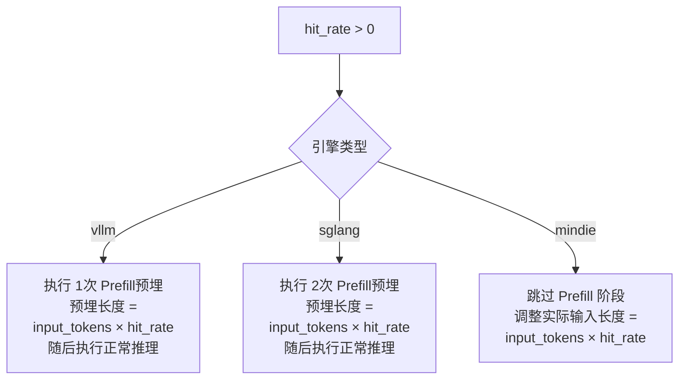

# 🚀 LLM 性能测试套件 | LLM Performance Benchmark

> 🎯 **核心能力**：在多样化负载条件下，精准测量推理服务的**延迟分布**（TTFT/TBT）、**吞吐上限**、**并发稳定性**及**Prefix Caching 命中效果**。

---

## 📋 目录

- [🔧 功能概述](#-功能概述)
- [⚙️ 配置体系](#️-配置体系)
- [🎮 测试执行](#-测试执行)
- [📊 结果解读](#-结果解读)
- [✅ 质量门禁](#-质量门禁)

---

## 🔧 功能概述

本测试框架专为 **LLM 推理服务** 设计，支持对以下关键维度进行自动化评估：

| 测试维度 | 评估重点 | 适用场景 |
|---------|---------|---------|
| ⏱️ **延迟分析** | TTFT (首Token延迟)、TBT (Token间隔延迟)、端到端延迟 | 实时交互应用（Chatbot） |
| 🚀 **吞吐能力** | Total / Incremental Throughput | 高并发批量处理 |
| 🔄 **并发稳定性** | 不同并发度下的性能衰减曲线 | 容量规划与限流策略 |
| 💾 **缓存效能** | Prefix Cache Hit Rate (Prefill 复用率) | 长上下文重复查询优化 |

---

## ⚙️ 配置体系

### 1️⃣ 基础环境配置 (`config.yaml`)

定义**模型、服务端点与环境参数**：

| 参数 | 类型 | 必填 | 说明 | 示例值 |
|------|------|------|------|--------|
| `model` | string | ✅ | 模型标识名称 | `Qwen3-32B` |
| `server_url` | string | ✅ | 推理服务 HTTP 端点 | `http://141.111.32.70:8244` |
| `tokenizer_path` | string | ✅ | Tokenizer 本地路径 | `/mnt/model/Qwen3-32B` |
| `llm_type` | enum | ✅ | 推理引擎类型 | `vllm` / `sglang` / `mindie` |
| `enable_clear_hbm` | bool | ✅ | 测试前清除显存 | `true` (默认) |
| `timeout` | int | ✅ | 单请求超时时间(秒) | `180` (默认) |

#### 🧩 引擎特性差异：Hit Rate 处理逻辑

不同引擎对 **Prefix Caching (hit_rate)** 的实现机制存在差异：



<details>
<summary>📋 详细行为对照表</summary>

| 引擎 | Prefill 策略 | 实际输入计算 | 备注 |
|------|-------------|-------------|------|
| **vLLM** | 1次预埋 | `input_tokens` (不变) | 利用 vLLM 的 Automatic Prefix Caching |
| **SGLang** | 2次预埋 | `input_tokens` (不变) | 双重预热确保 KV Cache 稳定 |
| **MindIE** | 跳过 | `input_tokens × hit_rate` | 直接缩短输入长度模拟命中效果 |

</details>

---

### 2️⃣ 负载参数配置 (`test_uc_performance.py`)

定义**性能测试负载矩阵**，支持多组参数笛卡尔积组合：

| 参数 | 类型 | 说明 | 示例 |
|------|------|------|------|
| `mean_input_tokens` | list[int] | 平均输入长度分布 | `[512, 2048, 4096]` |
| `mean_output_tokens` | list[int] | 平均输出长度分布 | `[128, 512]` |
| `concurrent_requests` | list[int] | 并发请求数梯度 | `[1, 4, 8, 16]` |
| `max_num_completed_requests` | list[int] | 单轮最大完成数 | `[100, 50]` |
| `hit_rate` | list[int] | 缓存命中率(%) | `[0, 50, 90]` |
| `random_seed` | list[int] | 随机种子 | `[42, 0]` |

#### 🎲 Random Seed 策略

| 取值 | 行为 | 适用场景 |
|------|------|---------|
| `0` | 每轮生成**随机 Prompt** | 模拟真实流量分布 |
| `≠0` | 多轮**固定相同 Prompt** | 回归测试、A/B 对比 |


---

## 🎮 测试执行

### 📋 前置依赖

```bash
# 安装测试框架依赖
pip install -r requirements.txt

# 验证推理服务端点可达
curl http://<server_url>/health
```

### ▶️ 运行方式

```bash
cd test/

# 方式1：运行完整测试文件
pytest test_uc_performance.py -v

# 方式2：按阶段执行（如阶段0：基准测试）
pytest --stage=0

# 方式3：按特性标签执行
pytest --feature=uc_performance_test
```

### 🔍 实时监控

运行时可观察以下实时输出：

```diff
[ RUNNING ] Qwen3-32B | input=2048 | output=512 | concurrency=8 | hit_rate=50%
[ PROGRESS ] 45/100 requests completed (45%) | TTFT: 125ms | TBT: 18ms
[ COMPLETE ] Throughput: 156.3 tok/s | P99 Latency: 8.4s
```

---

## 📊 结果解读

### 📈 核心指标定义

#### ⏱️ 延迟维度 (Latency)

| 指标 | 说明 | 关注重点 |
|------|------|---------|
| `ttft_s` | Time To First Token | 首字响应速度，影响用户感知延迟 |
| `inter_token_latency_s` | Time Between Tokens | 流式输出流畅度 |
| `end_to_end_latency_s` | 总耗时 | 完整请求处理时间 |

**统计分位**：每项指标输出 **P50 / P90 / P99 / Mean**

#### 🚀 吞吐维度 (Throughput)

| 指标 | 计算方式 | 用途 |
|------|----------|------|
| `total_throughput` | Total Tokens / Total Time | 综合吞吐能力 |
| `incremental_throughput` | Output Tokens / Generation Time | 解码阶段纯效率 |

#### 📊 其他关键指标

- `num_completed_requests`：成功完成数（对比期望值验证成功率）
- `elapsed_time`：单轮测试 wall-clock 时间
- `incremental_time_delay`：解码阶段时间开销

---

### 📝 输出格式示例

测试结果以结构化字典返回，便于存储数据库：

```python
{
    "_name": "llmperf",
    "_metadata": {
        "model": "Qwen3-32B",
        "timestamp": "2026-01-31T14:30:00Z",
        "config": { ... }
    },
    "_data": {
        # 延迟分布 (秒)
        "results_ttft_s_mean": 0.125,
        "results_ttft_s_quantiles_p50": 0.118,
        "results_ttft_s_quantiles_p99": 0.245,

        "results_inter_token_latency_s_mean": 0.018,
        "results_end_to_end_latency_s_mean": 4.567,

        # 吞吐指标 (tokens/s)
        "results_total_throughput": 245.8,
        "results_incremental_throughput": 198.3,

        # 请求统计
        "results_num_completed_requests": 100,
        "results_elapsed_time": 45.2
    }
}
```

---

## ✅ 质量门禁

### 🚨 自动校验规则

测试框架内置以下**硬性通过标准**：

```python
def validate_metrics(result: dict) -> bool:
    """
    验证所有数值指标有效性
    """
    critical_metrics = [
        'results_ttft_s_mean',
        'results_inter_token_latency_s_mean',
        'results_total_throughput',
        'results_num_completed_requests'
    ]

    for metric in critical_metrics:
        value = result['_data'].get(metric)

        # 规则1：数值必须存在
        if value is None:
            raise ValidationError(f"❌ {metric}: 返回值为 None")

        # 规则2：数值必须为正
        if value <= 0:
            raise ValidationError(f"❌ {metric}: {value} 不符合 >0 要求")

    return True
```

### ⚠️ 失败判定标准

| 异常类型 | 表现 | 处理建议 |
|---------|------|---------|
| **指标为 None** | 服务超时或统计失败 | 检查 `timeout` 配置，增大阈值 |
| **指标 ≤ 0** | 服务异常或计算错误 | 检查推理服务日志 |
| **完成数不足** | `num_completed < max_num_completed` | 检查并发压力是否过载导致丢请求 |

---

